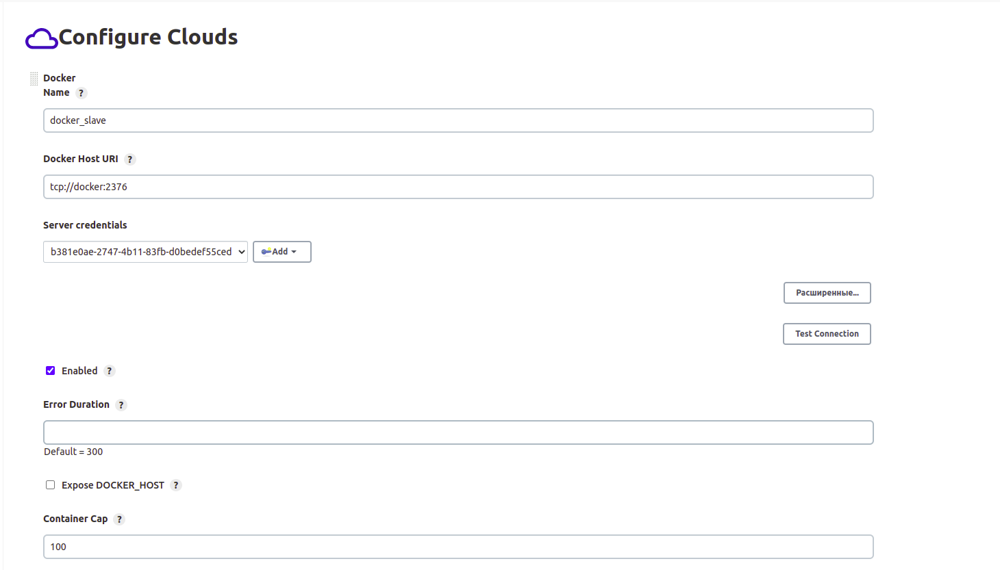
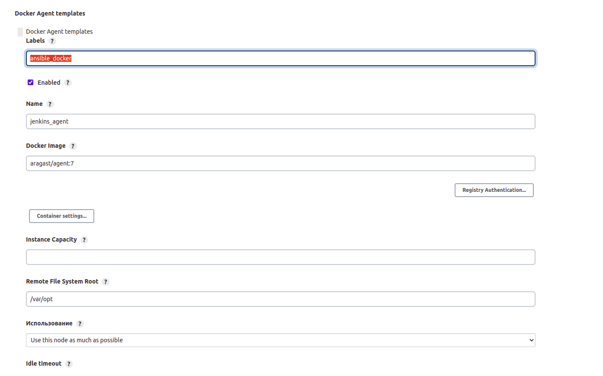
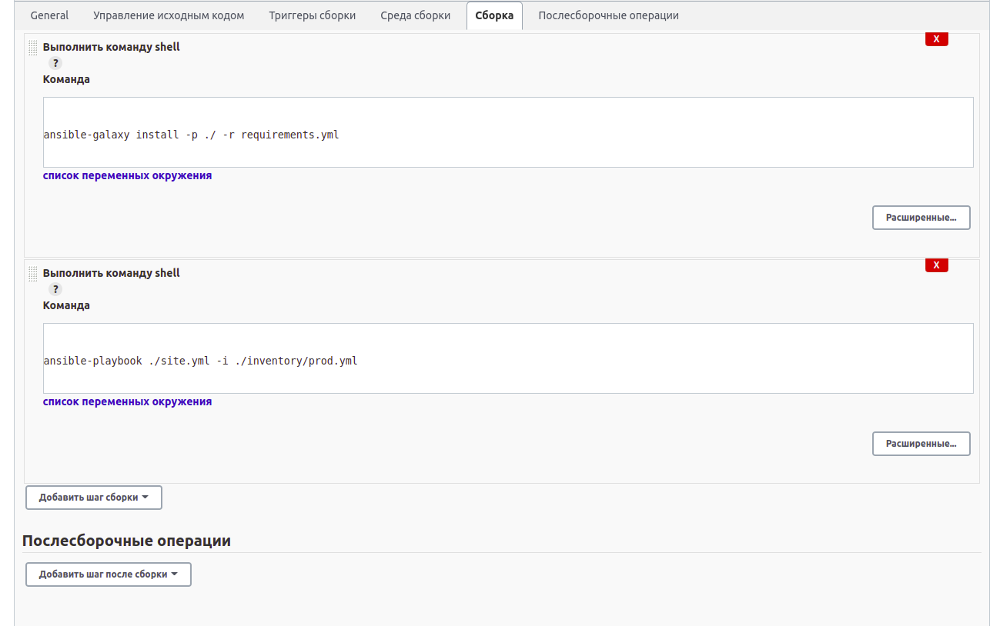
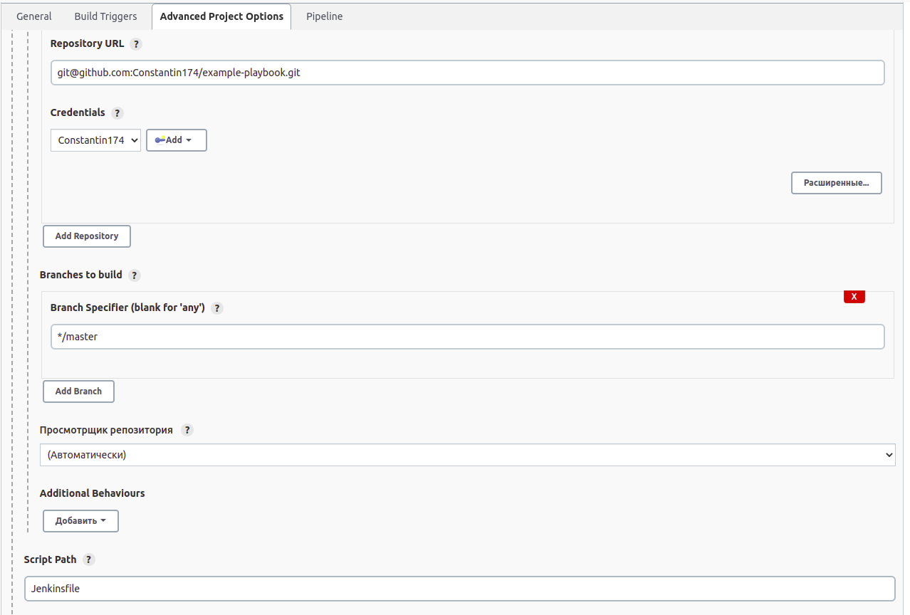
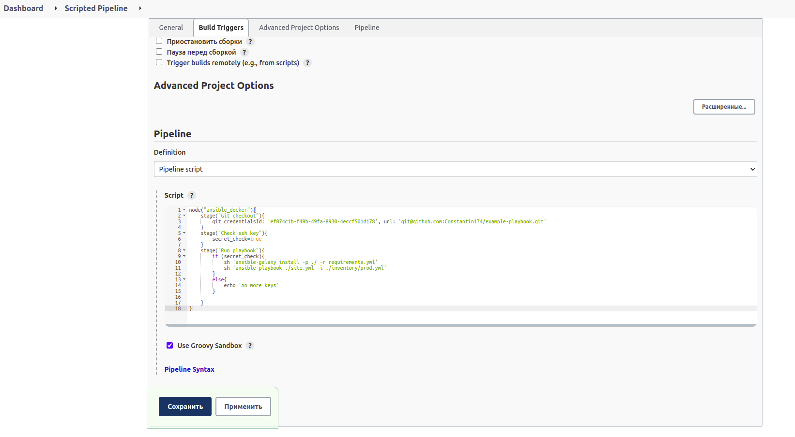

# devops-netology

## Домашнее задание к занятию "09.03 Jenkins"

### Подготовка к выполнению

1) Установить jenkins по любой из инструкций.
Выполнено. Для установки использовал образы докер docker:dind для работы динамических агентов и образ jenkins/jenkins:2.332.3-jdk11 с добавлением плагинов blueocean и docker-workflow.
2) Запустить и проверить работоспособность.
Выполнено. Jenkins запущен успешно, зашел под админом и паролем по умолчанию (нашел его в файле /var/lib/jenkins/secrets/initialAdminPassword).
3) Сделать первоначальную настройку.
Выполнено. Установил основные плагины.
4) Настроить под свои нужды.
Выполнено.
5) Поднять отдельный cloud.
Выполнено. Обнулил количество процессов-исполнителей в настройках мастер-узла, после чего создал cloud-узел. 
Для начала в настройках указал имя хоста и порт контейнера docker:dind, а также создал credentials полученный из сертификатов данного контейнера.

После чего добавил основные настройки для cloud-агента, включая добавление лейбла ansible_docker.

6) Для динамических агентов можно использовать образ
Выполнено.
7) Обязательный параметр: поставить label для динамических агентов: ansible_docker
Выполнено.
8) Сделать форк репозитория с playbook
Выполнено. Форк доступен по ссылке [ссылке](https://github.com/Constantin174/example-playbook).

### Основная часть

1) Сделать Freestyle Job, который будет запускать ansible-playbook из форка репозитория
Выполнено.

Лог сборки

```commandline
Started by user admin
Running as SYSTEM
Building remotely on jenkins_agent-0000jhzlt8xjx on docker_slave (ansible_docker) in workspace /var/opt/workspace/ansible-freestyle
The recommended git tool is: NONE
using credential ef074c1b-f48b-49fa-8930-4eccf501d178
Cloning the remote Git repository
Cloning repository git@github.com:Constantin174/example-playbook.git
 > git init /var/opt/workspace/ansible-freestyle # timeout=10
Fetching upstream changes from git@github.com:Constantin174/example-playbook.git
 > git --version # timeout=10
 > git --version # 'git version 1.8.3.1'
using GIT_SSH to set credentials 
 > git fetch --tags --progress git@github.com:Constantin174/example-playbook.git +refs/heads/*:refs/remotes/origin/* # timeout=10
 > git config remote.origin.url git@github.com:Constantin174/example-playbook.git # timeout=10
 > git config --add remote.origin.fetch +refs/heads/*:refs/remotes/origin/* # timeout=10
Avoid second fetch
 > git rev-parse refs/remotes/origin/master^{commit} # timeout=10
Checking out Revision e0906c3c67d73987fbc8095bc225282dc94cd98c (refs/remotes/origin/master)
 > git config core.sparsecheckout # timeout=10
 > git checkout -f e0906c3c67d73987fbc8095bc225282dc94cd98c # timeout=10
Commit message: "fix homework"
 > git rev-list --no-walk e0906c3c67d73987fbc8095bc225282dc94cd98c # timeout=10
[ansible-freestyle] $ /bin/sh -xe /tmp/jenkins3375490563747022527.sh
+ ansible-galaxy install -p ./ -r requirements.yml
Starting galaxy role install process
- extracting java to /var/opt/workspace/ansible-freestyle/java
- java (1.0.1) was installed successfully
[ansible-freestyle] $ /bin/sh -xe /tmp/jenkins5572562772788838813.sh
+ ansible-playbook ./site.yml -i ./inventory/prod.yml

PLAY [Install Java] ************************************************************

TASK [Gathering Facts] *********************************************************
ok: [localhost]

TASK [java : Upload .tar.gz file containing binaries from local storage] *******
skipping: [localhost]

TASK [java : Upload .tar.gz file conaining binaries from remote storage] *******
changed: [localhost]

TASK [java : Ensure installation dir exists] ***********************************
changed: [localhost]

TASK [java : Extract java in the installation directory] ***********************
changed: [localhost]

TASK [java : Export environment variables] *************************************
changed: [localhost]

PLAY RECAP *********************************************************************
localhost                  : ok=5    changed=4    unreachable=0    failed=0    skipped=1    rescued=0    ignored=0   

Finished: SUCCESS
```

2) Сделать Declarative Pipeline, который будет выкачивать репозиторий с плейбукой и запускать её.
Выполнено. Лог сборки.

```commandline
Started by user admin
Obtained Jenkinsfile from git git@github.com:Constantin174/example-playbook.git
[Pipeline] Start of Pipeline
[Pipeline] node
Still waiting to schedule task
‘jenkins_agent-0000jt25yo2fd on docker_slave’ is offline
Running on jenkins_agent-0000jt25yo2fd on docker_slave in /var/opt/workspace/Declarative Pipeline
[Pipeline] {
[Pipeline] stage
[Pipeline] { (Declarative: Checkout SCM)
[Pipeline] checkout
Selected Git installation does not exist. Using Default
The recommended git tool is: NONE
using credential ef074c1b-f48b-49fa-8930-4eccf501d178
Cloning the remote Git repository
Cloning repository git@github.com:Constantin174/example-playbook.git
 > git init /var/opt/workspace/Declarative Pipeline # timeout=10
Fetching upstream changes from git@github.com:Constantin174/example-playbook.git
 > git --version # timeout=10
 > git --version # 'git version 1.8.3.1'
using GIT_SSH to set credentials 
 > git fetch --tags --progress git@github.com:Constantin174/example-playbook.git +refs/heads/*:refs/remotes/origin/* # timeout=10
Avoid second fetch
Checking out Revision e0906c3c67d73987fbc8095bc225282dc94cd98c (refs/remotes/origin/master)
 > git config remote.origin.url git@github.com:Constantin174/example-playbook.git # timeout=10
 > git config --add remote.origin.fetch +refs/heads/*:refs/remotes/origin/* # timeout=10
 > git rev-parse refs/remotes/origin/master^{commit} # timeout=10
 > git config core.sparsecheckout # timeout=10
 > git checkout -f e0906c3c67d73987fbc8095bc225282dc94cd98c # timeout=10
Commit message: "fix homework"
 > git rev-list --no-walk e0906c3c67d73987fbc8095bc225282dc94cd98c # timeout=10
[Pipeline] }
[Pipeline] // stage
[Pipeline] withEnv
[Pipeline] {
[Pipeline] stage
[Pipeline] { (Clone repository)
[Pipeline] git
Selected Git installation does not exist. Using Default
The recommended git tool is: NONE
using credential ef074c1b-f48b-49fa-8930-4eccf501d178
Fetching changes from the remote Git repository
 > git rev-parse --resolve-git-dir /var/opt/workspace/Declarative Pipeline/.git # timeout=10
 > git config remote.origin.url git@github.com:Constantin174/example-playbook.git # timeout=10
Fetching upstream changes from git@github.com:Constantin174/example-playbook.git
 > git --version # timeout=10
 > git --version # 'git version 1.8.3.1'
using GIT_SSH to set credentials 
 > git fetch --tags --progress git@github.com:Constantin174/example-playbook.git +refs/heads/*:refs/remotes/origin/* # timeout=10
Checking out Revision e0906c3c67d73987fbc8095bc225282dc94cd98c (refs/remotes/origin/master)
Commit message: "fix homework"
 > git rev-parse refs/remotes/origin/master^{commit} # timeout=10
 > git config core.sparsecheckout # timeout=10
 > git checkout -f e0906c3c67d73987fbc8095bc225282dc94cd98c # timeout=10
 > git branch -a -v --no-abbrev # timeout=10
 > git checkout -b master e0906c3c67d73987fbc8095bc225282dc94cd98c # timeout=10
[Pipeline] }
[Pipeline] // stage
[Pipeline] stage
[Pipeline] { (Run ansible)
[Pipeline] sh
+ ansible-galaxy install -p ./ -r requirements.yml
Starting galaxy role install process
- extracting java to /var/opt/workspace/Declarative Pipeline/java
- java (1.0.1) was installed successfully
[Pipeline] sh
+ ansible-playbook ./site.yml -i ./inventory/prod.yml

PLAY [Install Java] ************************************************************

TASK [Gathering Facts] *********************************************************
ok: [localhost]

TASK [java : Upload .tar.gz file containing binaries from local storage] *******
skipping: [localhost]

TASK [java : Upload .tar.gz file conaining binaries from remote storage] *******
changed: [localhost]

TASK [java : Ensure installation dir exists] ***********************************
changed: [localhost]

TASK [java : Extract java in the installation directory] ***********************
changed: [localhost]

TASK [java : Export environment variables] *************************************
changed: [localhost]

PLAY RECAP *********************************************************************
localhost                  : ok=5    changed=4    unreachable=0    failed=0    skipped=1    rescued=0    ignored=0   

[Pipeline] }
[Pipeline] // stage
[Pipeline] }
[Pipeline] // withEnv
[Pipeline] }
[Pipeline] // node
[Pipeline] End of Pipeline
Finished: SUCCESS
```

3) Перенести Declarative Pipeline в репозиторий в файл Jenkinsfile.
Выполнено.
4) Перенастроить Job на использование Jenkinsfile из репозитория.
Выполнено.

5) Создать Scripted Pipeline, наполнить его скриптом из pipeline.
Выполнено.
6) Заменить credentialsId на свой собственный.
Выполнено.

7) Проверить работоспособность, исправить ошибки, исправленный Pipeline вложить в репозитрий в файл ScriptedJenkinsfile
Выполнено. Лог сборки.
```
Started by user admin
[Pipeline] Start of Pipeline
[Pipeline] node
Running on jenkins_agent-0000jvqsdz6s0 on docker_slave in /var/opt/workspace/Scripted Pipeline
[Pipeline] {
[Pipeline] stage
[Pipeline] { (Git checkout)
[Pipeline] git
Selected Git installation does not exist. Using Default
The recommended git tool is: NONE
using credential ef074c1b-f48b-49fa-8930-4eccf501d178
Cloning the remote Git repository
Cloning repository git@github.com:Constantin174/example-playbook.git
 > git init /var/opt/workspace/Scripted Pipeline # timeout=10
Fetching upstream changes from git@github.com:Constantin174/example-playbook.git
 > git --version # timeout=10
 > git --version # 'git version 1.8.3.1'
using GIT_SSH to set credentials 
 > git fetch --tags --progress git@github.com:Constantin174/example-playbook.git +refs/heads/*:refs/remotes/origin/* # timeout=10
Avoid second fetch
Checking out Revision e0906c3c67d73987fbc8095bc225282dc94cd98c (refs/remotes/origin/master)
 > git config remote.origin.url git@github.com:Constantin174/example-playbook.git # timeout=10
 > git config --add remote.origin.fetch +refs/heads/*:refs/remotes/origin/* # timeout=10
 > git rev-parse refs/remotes/origin/master^{commit} # timeout=10
 > git config core.sparsecheckout # timeout=10
 > git checkout -f e0906c3c67d73987fbc8095bc225282dc94cd98c # timeout=10
 > git branch -a -v --no-abbrev # timeout=10
 > git checkout -b master e0906c3c67d73987fbc8095bc225282dc94cd98c # timeout=10
Commit message: "fix homework"
First time build. Skipping changelog.
[Pipeline] }
[Pipeline] // stage
[Pipeline] stage
[Pipeline] { (Check ssh key)
[Pipeline] }
[Pipeline] // stage
[Pipeline] stage
[Pipeline] { (Run playbook)
[Pipeline] sh
+ ansible-galaxy install -p ./ -r requirements.yml
Starting galaxy role install process
- extracting java to /var/opt/workspace/Scripted Pipeline/java
- java (1.0.1) was installed successfully
[Pipeline] sh
+ ansible-playbook ./site.yml -i ./inventory/prod.yml

PLAY [Install Java] ************************************************************

TASK [Gathering Facts] *********************************************************
ok: [localhost]

TASK [java : Upload .tar.gz file containing binaries from local storage] *******
skipping: [localhost]

TASK [java : Upload .tar.gz file conaining binaries from remote storage] *******
changed: [localhost]

TASK [java : Ensure installation dir exists] ***********************************
changed: [localhost]

TASK [java : Extract java in the installation directory] ***********************
changed: [localhost]

TASK [java : Export environment variables] *************************************
changed: [localhost]

PLAY RECAP *********************************************************************
localhost                  : ok=5    changed=4    unreachable=0    failed=0    skipped=1    rescued=0    ignored=0   

[Pipeline] }
[Pipeline] // stage
[Pipeline] }
[Pipeline] // node
[Pipeline] End of Pipeline
Finished: SUCCESS

```
8) Отправить ссылку на репозиторий в ответе.
https://github.com/Constantin174/example-playbook
